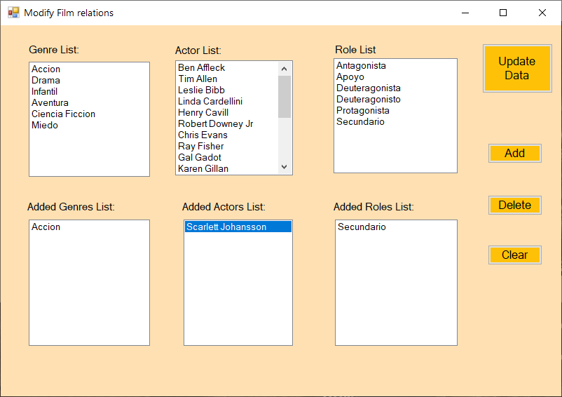

# Movie-and-cast-Managing-Application-master
VB.NET w/ Access DB

<h1>Screenshots</h1>
<ul>
<li>
<h2>Start Menu</h2>

<li>
<h2>View Films</h2>

</li>
<li>
<h2>Insert Films</h2>

</li>
<li>
<h2>View Actors</h2>

</li>
<li>
<h2>Modify Films</h2>

</li>
<li>
<h2>Modify Film relations</h2>

</li>
<li>
<h2>Modify Actors</h2>

</li>
<li>
<h2>Modify Actors´ realtions</h2>

</li>
<li>
<h2>Insert Actors</h2>

</li>
